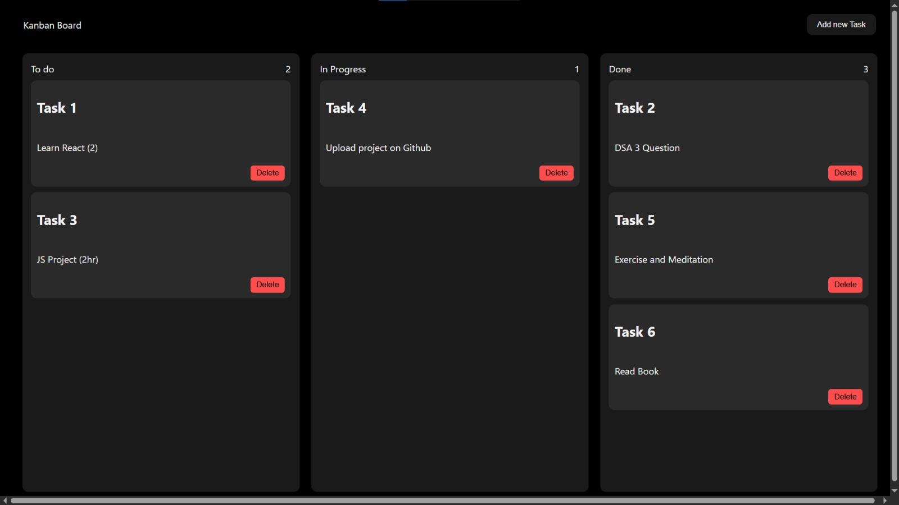
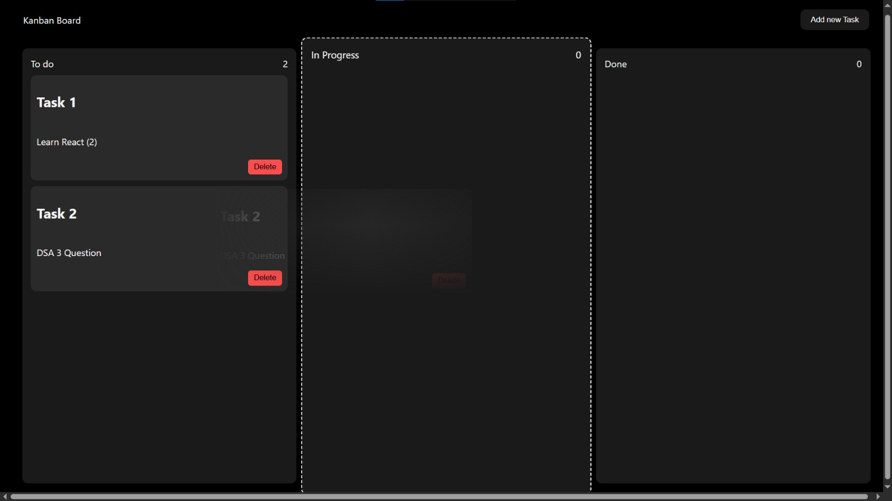

# 🗂️ Kanban Board

A modern and responsive **Kanban Board** built using **HTML, CSS, and Vanilla JavaScript**. It helps users organize tasks across different stages with an intuitive drag-and-drop interface. All tasks are automatically saved using **Local Storage**, so your data remains available even after refreshing or reopening the browser.

---

## 📸 Screenshots

### 🖥️ Main Board



### ➕ Add New Task



---

## ✨ Features

- ✅ Create new tasks
- ✅ Delete existing tasks
- ✅ Drag and drop tasks between columns
- ✅ Three task stages:
  - 📌 To Do
  - 🚧 In Progress
  - ✅ Done
- ✅ Automatic task counter for each column
- ✅ Local Storage support (tasks persist after refresh)
- ✅ Responsive layout
- ✅ Modern dark theme UI
- ✅ Clean and simple user experience

---

## 🛠️ Built With

- HTML5
- CSS3
- JavaScript (ES6)

---

## 📂 Project Structure

```
To-do-app/
│
├── assets/
│   ├── screenshot-1-main.jpeg
│   └── screenshot-2-main.jpeg
│
├── index.html
├── style.css
├── script.js
└── README.md
```

---

## 🚀 Getting Started

### Clone the repository

```bash
git clone https://github.com/vishesh4u/To-do-app.git
```

### Open the project

Simply open the `index.html` file in your browser.

No additional setup or installation is required.

---

## 🧠 JavaScript Concepts Used

- DOM Manipulation
- Event Listeners
- Drag and Drop API
- Local Storage API
- Arrays & Objects
- Functions
- Arrow Functions
- Template Literals
- Query Selectors
- Dynamic Element Creation
- Event Delegation

---

## 📋 How It Works

1. Click **Add New Task**.
2. Enter the task title and description.
3. Drag tasks between:
   - 📌 To Do
   - 🚧 In Progress
   - ✅ Done
4. Delete tasks when completed.
5. Tasks are automatically saved in **Local Storage**.

---

## 🔮 Future Improvements

- ✏️ Edit existing tasks
- 🔍 Search tasks
- 🎯 Filter by status
- 📅 Due dates
- 🏷️ Task categories
- 🌙 Light/Dark mode toggle
- 📱 Better mobile experience

---

## 🤝 Contributing

Contributions, suggestions, and improvements are welcome.

1. Fork the repository
2. Create a new branch
3. Commit your changes
4. Open a Pull Request

---

## 👨‍💻 Author

**Vishesh Gurjar**

GitHub: https://github.com/vishesh4u

---

## ⭐ Show Your Support

If you found this project useful, consider giving it a ⭐ on GitHub!

It helps motivate me to build more open-source projects.

---

## 📄 License

This project is licensed under the **MIT License**.
